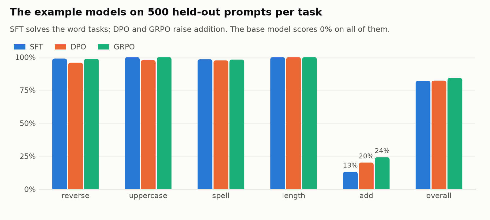
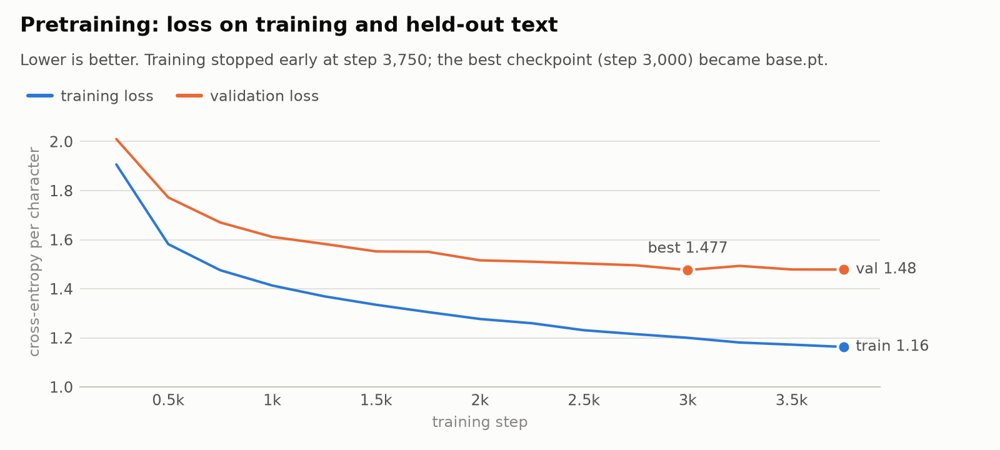
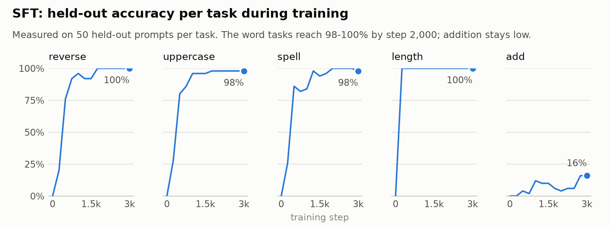
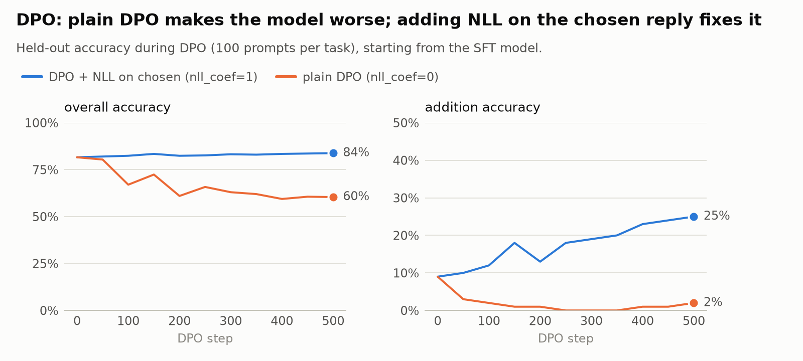
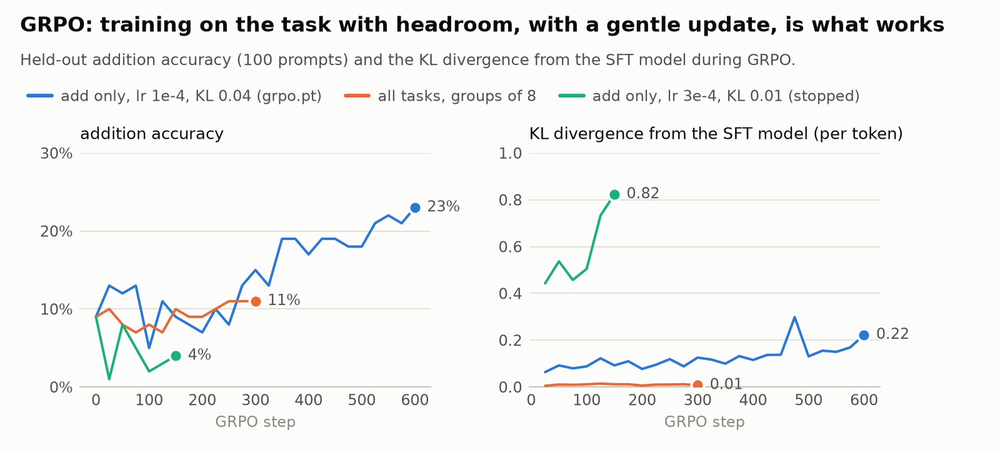

# Character-Level Transformer Language Model

[](https://github.com/Lior-Baruch/Char_Transformer_Language_Model/actions/workflows/tests.yml)
[](https://colab.research.google.com/github/Lior-Baruch/Char_Transformer_Language_Model/blob/master/notebooks/colab_pipeline.ipynb)

A small, readable PyTorch library for experimenting with the whole LLM training pipeline, one character at a time:

```
                 pretrain                 SFT                      DPO
data/input.txt ───────────▶ base model ─────────▶ instruct model ─────────▶ preference-tuned model
(Shakespeare)             (writes Shakespeare)   (follows instructions) │
                                                                        │  GRPO
                                                                        └─────────▶ RL-tuned model
```

1. **Pretraining.** A GPT-style transformer learns to predict the next character of Shakespeare's plays.
2. **Supervised fine-tuning (SFT).** The base model learns a chat format and a set of instruction-following tasks, such as "Reverse the word: love" → "evol".
3. **Preference tuning (DPO).** The instruct model is trained on pairs of a correct answer and one of its own wrong answers.
4. **Reinforcement learning (GRPO).** The instruct model samples several answers per prompt and is rewarded for the correct ones.

Every stage runs on a laptop CPU. The example models in `checkpoints/example/` were trained that way in about 70 minutes in total, and each stage measurably improves on the one before (see [Results](#results-of-the-example-models)).

The models can also learn to **reason step by step**. Given `reasoning: true`, SFT teaches them to write a scratchpad between `<|think|>` and `<|/think|>` before answering a math question: addition, subtraction, multiplication, division and word problems such as "Adam has 12 apples to divide equally among 3 friends. How many each?" (see [Reasoning](#reasoning-step-by-step)). And for a bigger model, [a Colab notebook](#a-bigger-model-on-a-gpu-colab) pretrains a 59M-parameter model on a billion characters of [TinyStories](https://huggingface.co/datasets/roneneldan/TinyStories) and fine-tunes it to reason.

## Install

The only dependency is [PyTorch](https://pytorch.org/).

```bash
pip install -e .          # installs the `charlm` package and command
# or, without installing: run `python -m charlm ...` from the repository root
```

## Quick start

Chat with the example models, or compare them on held-out prompts:

```bash
python -m charlm chat --model checkpoints/example/grpo.pt "Reverse the word: prince"
python -m charlm chat --model checkpoints/example/sft.pt          # interactive
python -m charlm generate --model checkpoints/example/base.pt --prompt "ROMEO:" --max-new-tokens 300
python -m charlm eval --model checkpoints/example/{sft,dpo,grpo}.pt --show 2
```

Train the whole pipeline yourself (each stage reads the previous stage's checkpoint):

```bash
python -m charlm pretrain --config configs/example/pretrain.json   # ~35 min on 4 CPU cores
python -m charlm sft      --config configs/example/sft.json
python -m charlm dpo      --config configs/example/dpo.json
python -m charlm grpo     --config configs/example/grpo.json
```

Any config option can be overridden from the command line, which makes quick experiments easy:

```bash
python -m charlm grpo --config configs/example/grpo.json --set kl_coef=0 group_size=16 out_path=runs/grpo_nokl.pt
python -m charlm pretrain --config configs/example/pretrain.json --set model.n_layer=6 --print-config
```

Each run writes a checkpoint (`out_path`) and its metrics as JSON lines next to it (`*.metrics.jsonl`), ready for plotting and comparing runs. Every stage also saves its full training state at each evaluation (`*.state.pt`, deleted when the run finishes; `state_every=N` saves it every N evaluations instead, for big models). If a run is interrupted, run the same command with `--set resume=true`. On a CPU it continues exactly where it left off, bit for bit. On a GPU the random-number state is restored too, but some GPU operations aren't deterministic, so the numbers can differ slightly. With `resume=true`, a stage that already finished is skipped, so a whole pipeline can simply be rerun after a crash. Resuming refuses to continue a run whose settings changed, since that would mix two different runs.

Training uses the GPU automatically when there is one (`device` defaults to `auto`). `precision` sets the number format: `fp32` (the default), `bf16`, `fp16`, or `auto`, which picks bf16 on GPUs that support it natively (A100, L4, RTX 30xx and newer), fp16 with loss scaling on older ones (T4, V100) and fp32 on a CPU. 16-bit training is several times faster on a GPU. `configs/pretrain_gpu.json` is the original 10.8M-parameter model, for use on a GPU.

## A bigger model on a GPU (Colab)

[](https://colab.research.google.com/github/Lior-Baruch/Char_Transformer_Language_Model/blob/master/notebooks/colab_pipeline.ipynb)

`notebooks/colab_pipeline.ipynb` runs the pipeline on a Colab GPU with the configs in `configs/colab/`:

| stage | what it does | rough time on an A100 |
|---|---|---|
| data | download TinyStories and keep the first billion characters | ~5 min |
| pretrain | 59M parameters (12 layers, 640-dim, 10 heads, 512-character context), 60,000 steps of 64 x 512 characters | ~2 h |
| SFT | all nine checkable tasks, with reasoning | ~20 min |
| GRPO | the five math tasks, 32 prompts x 16 replies per step | ~30 min |

The times are estimates: this repository's own runs are on a CPU. An L4 is roughly three times slower, so the notebook has a `MAX_ITERS` setting to shorten pretraining. Training runs in bf16 (`"precision": "auto"`). Data and checkpoints are kept on Google Drive. If Colab disconnects, run all the cells again: finished stages are skipped and the interrupted one resumes from its last saved state.

### More training data

`prepare-data` downloads a corpus and cleans it to the tokenizer's characters (printable ASCII and newline: curly quotes become straight ones, accents are dropped, and so on):

```bash
python -m charlm prepare-data tinystories                      # ~2.7M short stories, ~2.2 GB -> data/tinystories.txt
python -m charlm prepare-data tinystories --max-chars 50000000  # just the first 50M characters
python -m charlm prepare-data shakespeare                      # the complete works, 5x data/input.txt -> data/shakespeare.txt
python -m charlm prepare-data files --files my_texts/*.txt --out data/mine.txt   # your own text files
python -m charlm pretrain --config configs/example/pretrain.json --set data_path=data/shakespeare.txt
```

The data is streamed, so it is never held in memory whole. A `.json` file next to the output records what was prepared, so running the same command again skips the download. The SFT tasks still take their words from `corpus_path` (`data/input.txt` by default), whatever the base model was pretrained on.

## Results of the example models

All four models have 1.84M parameters (192-dim embeddings, 4 layers, 4 heads, 128-character context). They were trained on 4 CPU cores in about 70 minutes: pretraining 33 min, SFT 15, DPO 10, GRPO 11. Accuracy on 500 held-out prompts per task:

```bash
python -m charlm eval --model checkpoints/example/{base,sft,dpo,grpo}.pt --n-per-task 500
```

| model | reverse | uppercase | spell | length | add | overall |
|---|---|---|---|---|---|---|
| `base.pt` | 0% | 0% | 0% | 0% | 0% | 0% |
| `sft.pt` | 99.0% | 100% | 98.4% | 100% | 13.2% | 82.1% |
| `dpo.pt` | 95.8% | 97.8% | 97.6% | 100% | 20.2% | 82.3% |
| `grpo.pt` | 98.8% | 100% | 98.2% | 100% | **24.2%** | **84.2%** |

<picture>
  <source media="(prefers-color-scheme: dark)" srcset="docs/figures/final_comparison_dark.png">
  
</picture>

The accuracy curves below (SFT, DPO and GRPO) are measured during training on 100 held-out prompts per task (50 for SFT), so they are noisier than the 500-prompt table. The figures and example tables are generated by `docs/make_figures.py` and `docs/make_examples.py` from the files in `checkpoints/example/`.

### Pretraining

The base model reaches val loss 1.477, the same as the original 10.8M-parameter notebook model (1.478) with a sixth of the parameters. The gap between training and validation loss keeps growing, so early stopping ended the run at step 3,750 and kept the best checkpoint, from step 3,000.

<picture>
  <source media="(prefers-color-scheme: dark)" srcset="docs/figures/pretraining_loss_dark.png">
  
</picture>

It writes Shakespeare and ignores instructions. Given "ROMEO:" it continues with a scene:

```
ROMEO:
Still to us.

First Musician:
Ay, as I had not seen to-morrow?

ANGELO:
Beseech you, be not a love.
```

Asked "Reverse the word: toy", it just keeps writing a play (" the common of the strength…"). That's why it scores 0% on every task.

### SFT

SFT teaches the chat format and the word tasks: they reach 84-100% accuracy by step 1,000 and 98-100% by step 2,000. "Reverse the word: shakespeare" → "eraepsekahs". Its replies to "Say a line as …" sound Shakespearean, if not very meaningful (examples below).

<picture>
  <source media="(prefers-color-scheme: dark)" srcset="docs/figures/sft_accuracy_dark.png">
  
</picture>

Addition is the hard task. The model gets the size of the answer right (first digit 92%, number of digits 98%), but its last digit is close to a random guess, so only 13% of its answers are exact. That leaves room for the next two stages.

### DPO

DPO raises addition from 13% to 20%, at a small cost on reverse and uppercase. This takes `nll_coef=1`. Plain DPO (`nll_coef=0`) made the model worse: overall 82% → 60%, addition 13% → 2%.

<picture>
  <source media="(prefers-color-scheme: dark)" srcset="docs/figures/dpo_comparison_dark.png">
  
</picture>

The reason is in the pairs. They come from the SFT model's own mistakes, and for addition the correct and wrong answers differ by a digit or two:

| prompt | chosen (correct answer) | rejected (the SFT model's own sampled answer) |
|---|---|---|
| What is 98 + 38? | `136` | `132` |
| What is 15 + 60? | `75` | `74` |
| What is 31 + 96? | `127` | `120` |
| Spell out: universal | `u-n-i-v-e-r-s-a-l` | `u-n-i-v-e-r-s-Al-l` |
| Spell out: beam | `b-e-a-m` | `b-e-n-m` |
| How many letters are in "courtship"? | `9` | `2` |

Plain DPO then pushes down the probability of both the chosen and the rejected answer. Adding the next-token loss on the chosen answer, as in [RPO](https://arxiv.org/abs/2404.19733), prevents that. You can see it in `dpo.metrics.jsonl`: `train_chosen_reward` rises while `train_rejected_reward` falls. All 4,000 pairs are in `checkpoints/example/dpo.pairs.jsonl`.

### GRPO

GRPO raises addition from 13% to 24% without hurting the other tasks. Over training, the reward on sampled replies doubles (8% → 17%).

<picture>
  <source media="(prefers-color-scheme: dark)" srcset="docs/figures/grpo_comparison_dark.png">
  
</picture>

Three choices mattered:
- **It trains on addition only** (`"tasks": ["add"]`). The word tasks are already solved, so every reply in their groups gets the same reward and carries no learning signal. Trained on all tasks, only ~10% of groups had any signal, and addition didn't move (13.0%).
- **Groups of 16 replies.** With this group size, ~70% of addition groups contain both right and wrong answers.
- **A gentle update.** A higher learning rate (3e-4) with a weaker KL penalty (0.01) was unstable: the KL to the reference jumped past 0.8 and the reward fell.

The logs of the two runs that didn't work are in `checkpoints/example/experiments/`.

<details>
<summary>What the GRPO training log looks like</summary>

```
device cpu | 16 prompts x 16 replies per step | 500 eval prompts
step 0 | acc 0.816 | acc/reverse 1 | acc/uppercase 1 | acc/spell 0.99 | acc/length 1 | acc/add 0.09 | 3s
step 25 | reward 0.07969 | kl 0.0637 | loss 0.002548 | reply_len 3.484 | groups_with_signal 0.63 | acc 0.824 | acc/reverse 1 | acc/uppercase 1 | acc/spell 0.99 | acc/length 1 | acc/add 0.13 | 32s
step 300 | reward 0.1064 | kl 0.1257 | loss 0.005026 | reply_len 3.505 | groups_with_signal 0.675 | acc 0.822 | acc/reverse 0.99 | acc/uppercase 0.99 | acc/spell 0.98 | acc/length 1 | acc/add 0.15 | 315s
step 600 | reward 0.1698 | kl 0.2222 | loss 0.008886 | reply_len 3.483 | groups_with_signal 0.7475 | acc 0.836 | acc/reverse 0.99 | acc/uppercase 0.99 | acc/spell 0.97 | acc/length 1 | acc/add 0.23 | 628s
saved model to checkpoints/example/grpo.pt
```

- `reward`: the share of sampled replies that were correct in this step's groups.
- `kl`: how far the model has moved from the SFT model, per token.
- `groups_with_signal`: the share of groups with both right and wrong replies. Only those groups teach the model anything.
- `acc/...`: greedy accuracy on held-out prompts, measured every 25 steps.

</details>

### Example replies

These are the first prompts of each task in the 500-per-task evaluation set above, not hand-picked, answered greedily by each model:

| prompt | expected | SFT | DPO | GRPO |
|---|---|---|---|---|
| Reverse the word: toy | `yot` | `yot` ✓ | `yot` ✓ | `yot` ✓ |
| Reverse the word: faster | `retsaf` | `retsaf` ✓ | `retsaf` ✓ | `retsaf` ✓ |
| Write in capital letters: oppression | `OPPRESSION` | `OPPRESSION` ✓ | `OPPRESSION` ✓ | `OPPRESSION` ✓ |
| Spell out: pipes | `p-i-p-e-s` | `p-i-p-e-s` ✓ | `p-i-p-e-s` ✓ | `p-i-p-e-s` ✓ |
| Spell out: meteors | `m-e-t-e-o-r-s` | `m-e-t-e-o-r-s` ✓ | `m-e-t-e-o-r-s` ✓ | `m-e-t-e-o-r-s` ✓ |
| How many letters are in "conqueror"? | `9` | `9` ✓ | `9` ✓ | `9` ✓ |
| What is 65 + 11? | `76` | `72` ✗ | `77` ✗ | `77` ✗ |
| What is 32 + 95? | `127` | `122` ✗ | `127` ✓ | `122` ✗ |
| What is 27 + 41? | `68` | `66` ✗ | `67` ✗ | `61` ✗ |
| What is 33 + 96? | `129` | `122` ✗ | `126` ✗ | `122` ✗ |
| What is 53 + 19? | `72` | `72` ✓ | `70` ✗ | `72` ✓ |

The word tasks are easy for all three. On addition, every wrong answer here has the right leading digits and a wrong last digit, as described under SFT. Each model gets one of these five right; five prompts are too few to show the differences in the table above.

The "Say a line as …" task has no single right answer, so DPO and GRPO don't train on it. SFT and GRPO replies:

| prompt | SFT | GRPO |
|---|---|---|
| Say a line as ROMEO. | I would I have something the countest of him. | I would I have so. |
| Say a line as JULIET. | I would not her had something the city of him. | I would you have some to have some offer'd |
| Say a line as KING RICHARD III. | What is the country the countest? | Then I say, and so shall I stay. |
| Say a line as Nurse. | I would I have so so. | I would I have so. |

They sound Shakespearean, if not very meaningful. GRPO gives the same line for two different speakers.

## Using it as a library

```python
from charlm import load_checkpoint, chat, TaskSuite, evaluate_tasks, load_config, SFTConfig, sft

model, tokenizer, meta = load_checkpoint("checkpoints/example/sft.pt")
print(chat(model, tokenizer, "Spell out: crown"))            # c-r-o-w-n

suite = TaskSuite(open("data/input.txt").read())
print(evaluate_tasks(model, tokenizer, suite.eval_set(100)))  # {'acc': ..., 'acc/reverse': ..., ...}

cfg = load_config(SFTConfig, "configs/example/sft.json", ["max_iters=500", "out_path=runs/sft_short.pt"])
model, tokenizer = sft(cfg)
```

The building blocks are exposed too: `CharTransformerLanguageModel` and `ModelConfig`, `CharTokenizer`, `sample_replies` (batched sampling), `encode_chat_example` (loss masking), `dpo.dpo_loss`, `grpo.grpo_loss`, `grpo.group_advantages`.

## How it works

### Tokenizer and chat template

Each character is one token. The vocabulary is every printable ASCII character and newline, so digits and symbols that never appear in Shakespeare can still be used later. It also has four special tokens (six with the [reasoning tokens](#reasoning-tokens)). A conversation turn looks like this:

```
<|user|>Reverse the word: love<|assistant|>evol<|end|>
```

### Model

A decoder-only transformer (`charlm/model.py`):
- Token and position embeddings.
- Pre-norm transformer blocks, each with causal multi-head self-attention and a feed-forward network (ReLU, 4x wide).
- A final LayerNorm and a linear layer that outputs the next-token scores.

Attention is scaled by 1/sqrt(head_size). When generating, a KV cache keeps each layer's keys and values, so each new token costs one position instead of the whole context.

### 1. Pretraining (`charlm/pretrain.py`)

- Random 128-character windows of the text are used as training inputs, and the target at every position is the next character.
- The last 10% of the text is held out as validation data.
- `data_path` can be a file, a directory of `.txt` files, a pattern like `"data/*.txt"`, or a list of these. With several files, the end of each file is held out (at most `max_val_chars` characters per file). ASCII text is stored as one byte per character, so a 1 GB corpus fits in 1 GB of memory.
- The learning rate follows a linear warmup, then a cosine decay.
- The checkpoint with the lowest validation loss is kept, and training stops early once the validation loss stops improving.

### 2. Supervised fine-tuning (`charlm/sft.py`)

- The model is trained on (prompt, response) pairs in the chat template.
- The loss is computed only on the response and `<|end|>` tokens. The prompt positions get target `-100`, so the model learns to answer rather than to imitate the user.
- The data is synthetic by default (see Tasks below). You can pass your own JSONL file of `{"prompt": ..., "response": ...}` rows with `data_path`.

### Tasks (`charlm/tasks.py`)

The instruction data is generated from the corpus. Every task except `speak` has one correct answer, so a reply can be checked automatically:

| task | example prompt | answer |
|---|---|---|
| reverse | `Reverse the word: love` | `evol` |
| uppercase | `Write in capital letters: love` | `LOVE` |
| spell | `Spell out: love` | `l-o-v-e` |
| length | `How many letters are in "love"?` | `4` |
| add | `What is 38 + 45?` | `83` |
| sub | `What is 704 - 358?` | `346` |
| mul | `What is 386 * 7?` | `2702` |
| div | `What is 912 / 8?` | `114` |
| word | `Adam has 12 apples to divide equally among 3 friends. How many each?` | `4` |
| speak | `Say a line as ROMEO.` | a line ROMEO speaks in the play (SFT only, not checkable) |

Because the answers can be checked, the same tasks give labeled data for SFT, correct/wrong pairs for DPO and a reward for GRPO.

The first five tasks are the defaults. `sub`, `mul`, `div` and `word` are used when a config lists them in `tasks`. Words are 3 to 12 letters long and `add` uses numbers up to 99. `sub` uses numbers up to 999 (never below zero), `mul` multiplies a number up to 999 by one digit, and `div` divides by one digit with no remainder. Word problems use one operation on small numbers, in four phrasings per operation.

20% of the words, number problems and speeches are held out, and so is one phrasing of each word problem. All accuracy numbers are measured on those held-out prompts, so they show whether the model learned the task rather than memorized the training examples (or, for word problems, the phrasing).

### Reasoning tokens

With `reasoning: true`, SFT adds two special tokens, `<|think|>` and `<|/think|>`, and the replies to the math tasks show their work before the answer. The scratchpads work digit by digit, like arithmetic on paper, so each step is small enough for a tiny model to learn:

```
What is 47 + 85?   <|think|>7+5+0=12 A=2, 4+8+1=13 A=132 => 132<|/think|>132
What is 82 - 47?   <|think|>2-7-0=5 b1 A=5, 8-4-1=3 b0 A=35 => 35<|/think|>35
What is 47 * 6?    <|think|>7*6=42+0=42 A=2, 4*6=24+4=28 A=282 => 282<|/think|>282
What is 84 / 6?    <|think|>08/6=1 r2 A=1, 24/6=4 r0 A=14 => 14<|/think|>14
Maya has 12 cookies to divide equally among 3 friends. How many each?
                   <|think|>12/3: 01/3=0 r1 A=0, 12/3=4 r0 A=04 => 4<|/think|>4
```

- Addition and multiplication go from the rightmost digit, writing the carry (`+1`). Subtraction writes the borrow (`b1`). Division goes from the left, writing the remainder (`r2`).
- `A=` is the answer so far. The trace ends with `=> answer`, which the model then copies after `<|/think|>`.
- Word problems first write the equation (`12/3:`), so the model has to work out which operation the story needs.
- Only the final answer is scored. The evaluation also reports `trace/<task>`, the share of replies whose reasoning matches the taught method exactly.

The tokens are appended after the existing ones, so a model without them (like `base.pt`) keeps every token id. The model's embedding grows by two rows (`model.resize_vocab`). DPO builds its chosen replies with the reasoning when the model has these tokens, and GRPO logs `closed_think`, the share of sampled replies that finish their reasoning within `max_new_tokens`. A reply that is cut off has no answer and gets reward 0.

### 3a. DPO (`charlm/dpo.py`)

[Direct Preference Optimization](https://arxiv.org/abs/2305.18290) trains on (prompt, chosen, rejected) triples. The loss is:

```
loss = -log sigmoid(beta * ((log π(chosen) - log π_ref(chosen)) - (log π(rejected) - log π_ref(rejected))))
```

- It raises the probability of the chosen reply and lowers the rejected one, relative to a frozen reference model (the SFT model).
- `beta` limits how far the model can move away from the reference.
- By default the pairs come from the model's own mistakes. The SFT model samples several replies per training prompt; for each prompt it got wrong at least once, the correct answer becomes "chosen" and a wrong reply becomes "rejected".
- The pairs are saved to `*.pairs.jsonl`. You can also supply your own pairs with `data_path`.
- `nll_coef` adds the ordinary next-token loss on the chosen reply. When chosen and rejected replies are nearly identical, plain DPO can lower the probability of both; this term keeps the chosen reply likely (see Results).

### 3b. GRPO (`charlm/grpo.py`)

[Group Relative Policy Optimization](https://arxiv.org/abs/2402.03300) is reinforcement learning with a verifiable reward and no value network. Each step works like this:

1. Sample `batch_size` training prompts from `tasks` and `group_size` replies to each, at temperature 1.
2. Reward each reply: 1 if it is correct, 0 if not.
3. Compute each reply's advantage relative to its own group: `(reward - group mean) / group std`. If a group's replies are all right or all wrong, they carry no signal.
4. Update the model with the PPO clipped objective on the reply tokens, plus a KL penalty (k3 estimator) that keeps it close to the reference model:

```
loss = -min(ratio * A, clip(ratio, 1 - eps, 1 + eps) * A) + kl_coef * KL(π || π_ref)
```

## Experiment ideas

- **Base model.** Scale the model or the context (`model.*`) and watch how the val loss and samples change. Or pretrain on more text (`prepare-data`) or your own (`data_path`).
- **Reasoning.** Change the scratchpad format in `reasoning.py` (e.g. drop the running answer `A=`, or the carries) and see which parts the model needs. Or train on 2-digit numbers and test on 3-digit ones.
- **SFT.** Train on less data (`n_train`), train on a subset of `tasks` and test on the others, or skip pretraining and see how much the base model helps.
- **DPO.** Sweep `beta` and `nll_coef`. Or build the pairs from a different model than the one being trained (`data_path`).
- **GRPO.** Sweep `kl_coef` (try 0), `group_size` and `temperature`, or set `updates_per_batch` > 1 so the clipping matters. Or give addition partial credit per correct digit, or add a task in `tasks.py` with its own reward.
- **Chain the stages.** Run GRPO starting from the DPO model (`init_from`), or run DPO on pairs sampled from the GRPO model.

## Project layout

```
charlm/
  tokenizer.py    character tokenizer with chat (and reasoning) special tokens
  model.py        the transformer, sampling with a KV cache, per-token log-probabilities
  checkpoint.py   save/load a model together with its config and tokenizer
  config.py       dataclass configs from JSON files + key=value overrides
  training.py     shared training utilities (optimizer, LR schedule, precision, resuming, metrics logging)
  data.py         text files and batches
  datasets.py     downloading and cleaning larger corpora (`prepare-data`)
  chat.py         chat template, loss masking, batched reply sampling
  tasks.py        synthetic instruction tasks with held-out splits and a reward
  reasoning.py    the <|think|> reply format and the step-by-step arithmetic traces
  evaluation.py   task accuracy
  pretrain.py     stage 1
  sft.py          stage 2
  dpo.py          stage 3a
  grpo.py         stage 3b
  cli.py          `python -m charlm ...`
configs/
  example/        the example models (CPU)
  reasoning/      SFT and GRPO with and without reasoning (CPU)
  colab/          the 59M-parameter pipeline (GPU)
notebooks/colab_pipeline.ipynb   the GPU pipeline on Colab
.github/workflows/tests.yml   CI: lint and tests on pull requests and pushes to master
.github/workflows/data.yml    CI: checks that the dataset downloads still work (when the data code changes)
checkpoints/example/   trained example models, their metrics and the DPO pairs
  experiments/  metrics of the variants and comparison runs
docs/             README figures and the scripts that make them (make_figures.py, make_examples.py)
data/input.txt    Tiny Shakespeare (1.1M characters)
tests/            pytest suite, including a tiny end-to-end run of the pipeline
char_transformer_language_model.ipynb   the original self-contained notebook walkthrough
```

Run the tests with `pip install pytest && pytest tests`. GitHub Actions also runs them, together with the `pyflakes` linter, on every pull request and every push to `master` (`.github/workflows/tests.yml`).

## The notebook

`char_transformer_language_model.ipynb` builds and trains the pretraining model step by step in a single file, without the library. It is a good place to start reading.

## License

This project is open source and available under the [MIT License](LICENSE).
